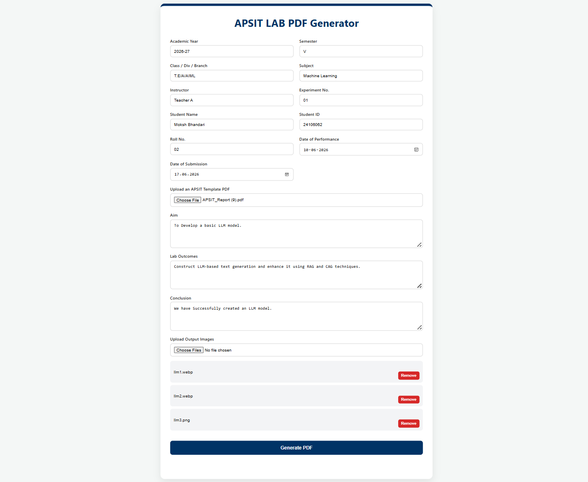
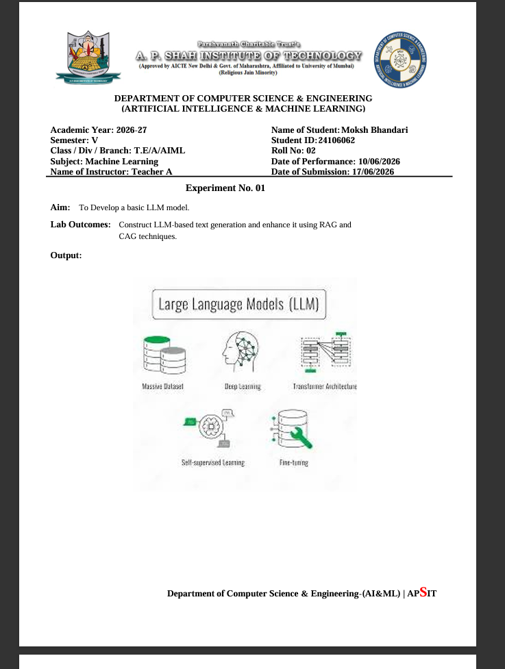
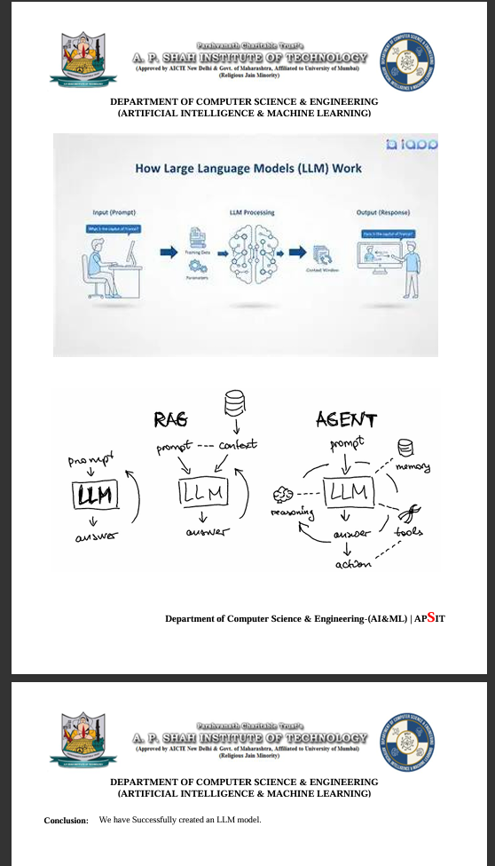
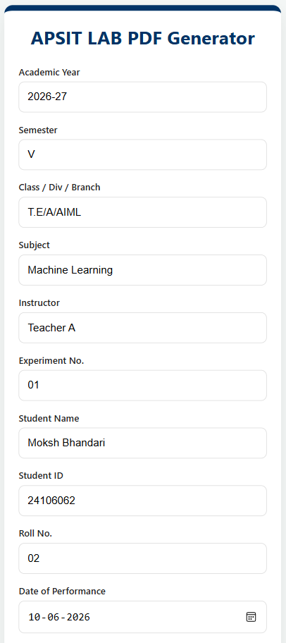
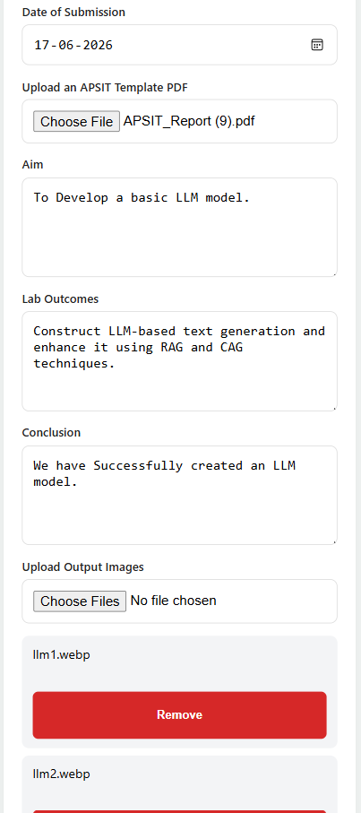
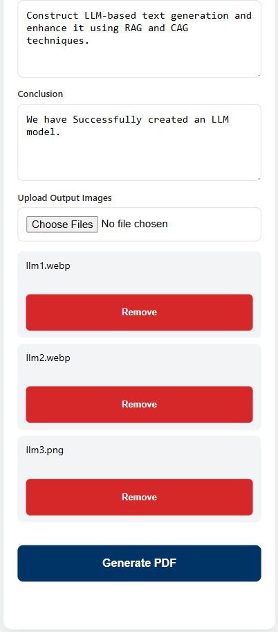

# APSIT Lab PDF Generator

## Overview

APSIT Lab PDF Generator is a FastAPI-based web application that automates the editing of APSIT laboratory experiment PDF templates. Instead of manually modifying experiment PDFs for every submission, users can upload an official APSIT template PDF, enter the required information, upload experiment output images, and generate a professionally formatted PDF while preserving the original document structure.

The application intelligently replaces only the editable content while keeping the official APSIT header and footer unchanged, making the PDF generation process faster, consistent, and user-friendly.

---

# Screenshots

## Home Page

*Upload the template PDF, enter experiment details, and attach output images.*



---

## Generated PDF

*Student details, experiment information, Aim, and Lab Outcomes are automatically updated while preserving the original APSIT template.*



---

## Automatic Image Placement

*Multiple experiment output images are inserted dynamically while preserving the official header and footer layout.*



---

## Mobile View

*Responsive interface optimized for both desktop and mobile devices.*





---

# Features

* Edit APSIT laboratory experiment PDF templates
* Automatically update student and experiment details
* Replace **Aim**
* Replace **Lab Outcomes**
* Replace **Conclusion**
* Preserve user formatting, including line breaks
* Upload and insert multiple output images
* Automatically create additional pages whenever required
* Preserve the official APSIT header and footer
* Maintain the original PDF layout and formatting
* Responsive user interface for desktop and mobile devices
* Automatic cleanup of temporary uploaded and generated files

---

# Problem Statement

Preparing laboratory experiment PDFs manually is repetitive and time-consuming. Students generally need to update only specific sections while ensuring that the official APSIT formatting remains unchanged.

This project automates that workflow by allowing users to modify only the required content while preserving the original template structure.

---

# How It Works

1. Upload an APSIT template PDF.
2. Enter student and experiment details.
3. Fill the Aim, Lab Outcomes, and Conclusion sections.
4. Upload one or more experiment output images.
5. The application processes the template.
6. Editable regions are updated while preserving the original layout.
7. Additional pages are automatically created whenever required.
8. The final PDF is generated and downloaded.

---

# Tech Stack

## Backend

* Python
* FastAPI
* PyMuPDF
* Pillow

## Frontend

* HTML
* CSS
* JavaScript

---

# Project Structure

```text
Pdf_Editor/
│
├── app.py
├── master_engine.py
├── requirements.txt
├── README.md
├── .gitignore
│
├── templates/
│     └── index.html
│
├── static/
│     ├── css/
│     │      └── style.css
│     │
│     └── js/
│            └── main.js
│
├── screenshots/
│     ├── home_page.png
│     ├── generated_pdf.png
│     ├── image_output_page.png
│     └── mobile_view.png
│
├── uploads/
│
└── outputs/
```

---

# Installation

## 1. Clone the repository

```bash
git clone https://github.com/Moksh-Bhandari/Pdf_Editor.git
```

## 2. Navigate to the project directory

```bash
cd Pdf_Editor
```

## 3. Create a virtual environment

### Windows

```bash
python -m venv venv
```

### macOS / Linux

```bash
python3 -m venv venv
```

---

## 4. Activate the virtual environment

### Windows

```bash
venv\Scripts\activate
```

### macOS / Linux

```bash
source venv/bin/activate
```

---

## 5. Install the required dependencies

```bash
pip install -r requirements.txt
```

---

## 6. Start the application

```bash
uvicorn app:app --reload
```

---

## 7. Open the application

Visit:

```text
http://127.0.0.1:8000
```

---

# Requirements

* Python 3.10 or later
* Modern web browser (Chrome, Edge, Firefox, etc.)

---

# Usage

* Upload an APSIT template PDF.
* Enter the required student and experiment information.
* Fill the Aim, Lab Outcomes, and Conclusion sections.
* Upload the experiment output images.
* Click **Generate PDF**.
* Download the generated PDF.

---

# Challenges Solved

* Dynamic text replacement inside PDF documents
* Preservation of the official APSIT template layout
* Image removal while maintaining header and footer integrity
* Automatic insertion of multiple experiment output images
* Automatic creation of additional pages when required
* Preservation of user-entered formatting and line breaks
* Responsive interface for desktop and mobile devices
* Automatic cleanup of temporary files after processing

---

# Future Improvements

* Live PDF preview before generation
* Support for multiple template formats
* Batch PDF generation
* Additional customization options for PDF formatting

---

# Author

**Moksh Bhandari**

Computer science(AIML) Engineering Student

A. P. Shah Institute of Technology

---

# License

This project is developed for educational purposes. Future versions may include an open-source license such as the MIT License.
